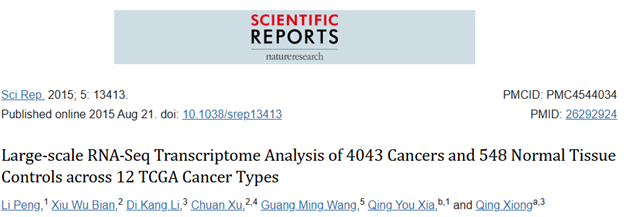

**Large-scale RNA-Seq Transcriptome Analysis of 4043 Cancers and 548 Normal Tissue Controls across 12 TCGA Cancer Types**

  A review of L. Peng et al., “Large-scale RNA-Seq Transcriptome Analysis of 4043 Cancers and 548 Normal Tissue Controls across 12 TCGA Cancer Types,” *Sci Rep*, vol. 5, p. 13413, Aug. 2015, doi: 10.1038/srep13413 
  
  Contributors: Pooja Solanki (@**poojasolanki2024)**, Alaa Hewela (@Alaa253), Chigozie Nkwocha (@**GozieNkwocha)** & Nourhan Saad (@**Nourhan-25)**   

## Introduction 

Cancer is one of the leading causes of death worldwide. Genetic and epigenetic mutations are two known factors that can cause a normal cell to undergo uncontrollable and abnormal cell growth and proliferation which may spread to other body parts. These driver mutations and epimutations may affect genes directly associated with cell cycle regulation or genes unrelated to the cell cycle but to a specific organ/tissue pathway that interacts with the cell cycle pathways \[1\]. Amongst these cancers are prostate, breast, pancreatic, lung, kidney, bladder and ovarian cancers \[2\]. The Cancer Genome Atlas (TCGA) database contains over 20,000 cancer cases with 33 cancer types \[3\]. Similarly, despite the huge amounts of genomic, transcriptomic, epigenomic and proteomic data in this database, translating them into biological insights for improved cancer diagnosis, treatment and prevention has been a major challenge.

## Aim

This study aims to understand and characterize alterations in gene expressions and identify gene signatures that are specific to one cancer type (organ or tissue-specific pathways) and present in many cancer types (cell cycle-associated pathways). To help guide the discovery of novel biomarkers and possible therapeutic targets.

## Methodology

In this study, Peng et al analyzed and compared RNA-seq data from TCGA database containing 4043 cancer samples and 548 normal tissue samples across 12 cancer types at the gene and gene set levels.

## Findings

* They identified differentially expressed (DE) genes and gene sets  
* Some DE genes and gene sets are altered in all cancer types while others are on one specific type.  
* Seven cross-cancer gene signatures were differentially expressed in at least 4 cancer types.  
* These gene signatures include genes with well-known roles in cancer and genes that could serve as potential new biomarkers for cancer.  
* From pathway analysis and disease association analysis, differentially expressed genes were linked to specific biological pathways related to the cell cycle or interact with the cell cycle pathway. They were also linked to causing genetic disorders, developmental defects and cancer. These diseases include aneuploidy and other forms of cancer and diseases such as lung cancer, bone marrow, bladder, prostate and kidney.  
* These identified gene signatures were also validated on and identified in non-TGCA datasets.

## Conclusion

From this study, the researchers unravelled organ/tissue-specific and cell cycle-related gene signatures that can cause cancer. Their findings add to existing knowledge by providing insights into the transcriptional processes of genes that can trigger tumour generation and metastasis. It also provides information on gene signatures that can be used for cancer diagnosis and treatment.

## Presentation

[Link to video presentation](https://www.linkedin.com/posts/alaa-hewela_cancerresearch-bioinformatics-rnaseq-activity-7238220214310469632-Or55?utm_source=share&utm_medium=member_desktop)

## References

\[1\] J. M. Cullen and M. Breen, “An Overview of Molecular Cancer Pathogenesis, Prognosis, and Diagnosis,” in Tumors in Domestic Animals, John Wiley & Sons, Ltd, 2016, pp. 1–26. Doi: 10.1002/9781119181200.ch1.  
\[2\] G. H. Williams and K. Stoeber, “The cell cycle and cancer,” The Journal of Pathology, vol. 226, no. 2, pp. 352–364, 2012, doi: 10.1002/path.3022.  
\[3\] “The Cancer Genome Atlas Program (TCGA) \- NCI.” Accessed: Sep. 06, 2024\. \[Online\].  
Available: https://www.cancer.gov/ccg/research/genome-sequencing/tcga 
