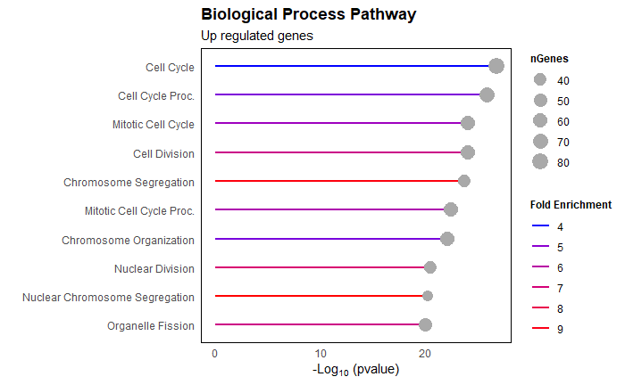
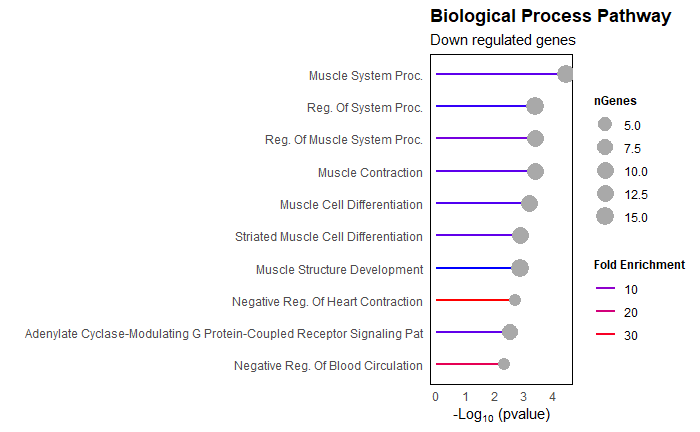
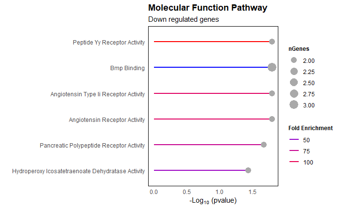
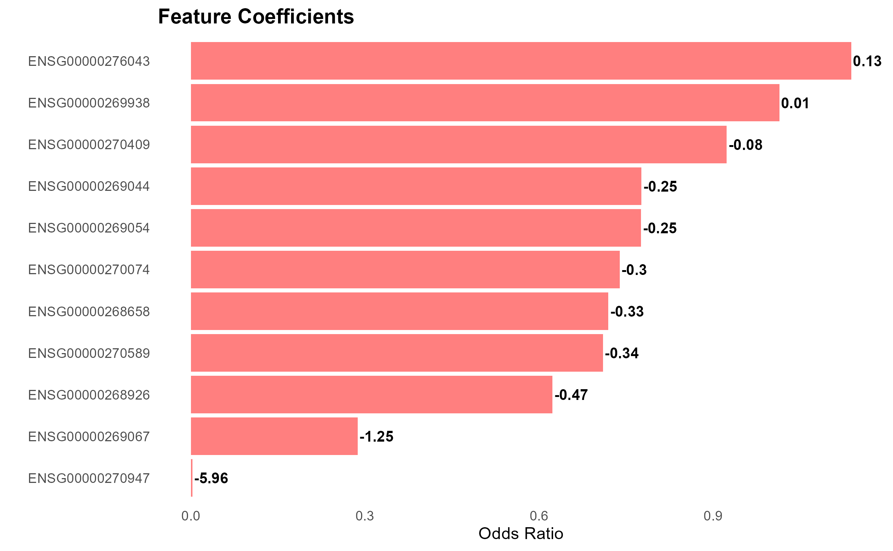
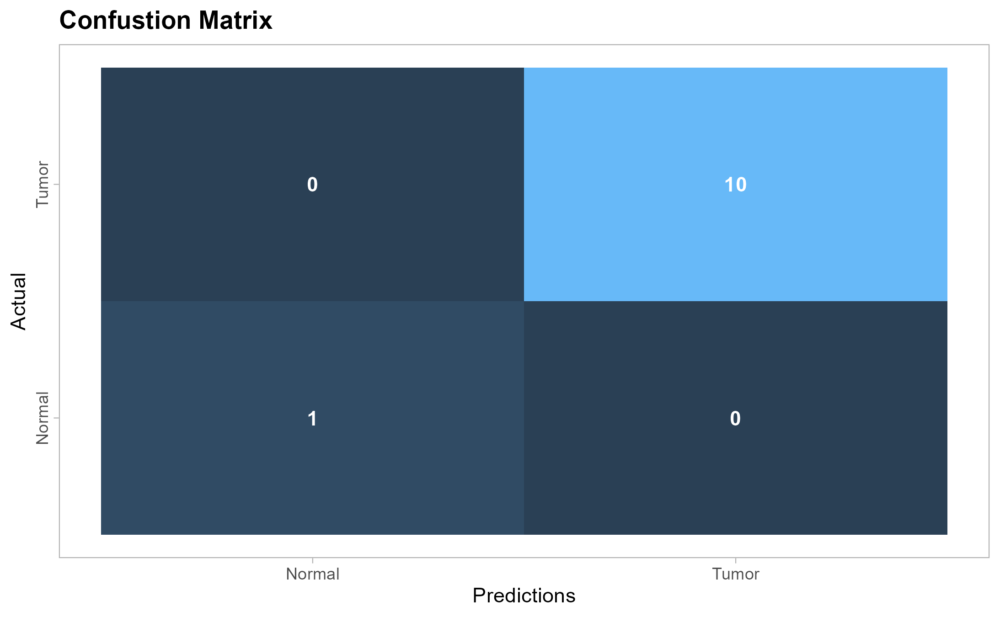

# **Stage 3 Task**

## **Overview**

In this project, you will work as a team. Your objective is to identify potential cancer biomarkers from a given dataset using differential expression and machine learning models. This project will require creative thinking and collaboration, leveraging the strengths of both fields.

- Form a team; 3 ML engineers and 5 biomarker developers

- Pick any cancer type/subtype and download from TCGA.

- Clean and preprocess the data (primarily biomarker team)
    - Handle missing values, normalize gene expression data.
    - Reduce the data to a maximum of 20 samples for the primary and 20 for the recurring tumor types. Please provide annotation for your data. (Feel free to pick other sample classification/categories you are interested in)
    - From here, the biomarker developer shares the dataset with machine learning engineer

- Biomarker Discovery Specialist would:
    - Conduct differential expression analysis
    - Conduct functional enrichment analysis

- ML Engineer would:
    - Prepare the data for ML
    - Perform feature selection
    - Conduct kNN or random forest classification

- Final Report
    - Submit you complete code from data collection, ML and differential expression analysis to final figures
    - Write a comprehensive report that includes:
        - Introduction to the selected cancer
        - Description of the dataset and preprocessing steps.
        - Detailed methodology for biomarker discovery and machine learning analysis.
        - Results and interpretations of the identified biomarkers and model performance.
        - Visualizations that effectively communicate your findings.
        - Conclusion and future directions for research.

# **Dataset selection and collection**

Cervical cancer project data downloaded from [TCGA](https://www.cancer.gov/ccg/research/genome-sequencing/tcga). Data collection and preparation were done in R using the `TCGAbiolinks` library. A total of 309 samples were found in this dataset. 304 primary tumour types, 3 normal samples and the rest metastasis. The primary tumor and normal tissue sample types were selected. To meet up with maximum number of 40 samples criteria, we selected all normal samples and randomly selected 37 tumour samples by stratifying by age group.

## **Data Preparation and Preprocessing**

Data preprocessing and normalisation were also done using the `TCGAbiolinks` library. Data preprocessing involves removing genes across samples with correlation less than 0.4, normalising expression levels based on gene length and GC content and removing genes with zeros below the 25th percentile.

## **Data Analysis**

### **Differential Gene Expression Analysis (DGE Analysis)**

Differential gene expression analysis was performed using the likelihood ratio method. Differentially expressed genes were selected based on the cutoff (false discovery ratio (FDR) < 0.01 and absolute log fold change value > 5), where genes with FDR < 0.01 & LogFC < -5 were grouped as downregulated genes and genes with FDR < 0.01 & LogFC > 5 as upregulated genes. Finally, the preprocessed counts (30,753 genes) data were saved for machine learning prediction.

The image below shows a volcano plot of significantly and not significantly expressed genes 

_**Fig 1**: Volcano plot showing upregulated, down regulated and not statistically significant genes_

### **Pathway Enrichment Analysis**
After selecting the upregulated and downregulated genes, pathway enrichment analysis was performed to understand the biological processes these genes are involved in, the molecular function and cellular localisation of their gene products, as well as their biochemical pathways. 

#### **Biological Processes**

From results, the cell-cycle pathway is highly enriched in the pathogenesis of cervical cancer. Most of the upregulated genes are directly involved in the cell cycle pathway, either as genes that are involved in the regulation of the mitotic or meiotic phase of cell division and differentiation. Other processes that are enriched are the muscular system and nervous system processes and other signalling pathways. Most of the downregulated genes are found to be invoved in striated muscle cell differentiation and muscle structure development, muscular contraction, negative regulation of heart rate an contraction, blood circulation or response to synaptic signalling.

_**Fig 2**: Biological Processes (Upregulated)_

_**Fig 3**: Biological Processes (downregulated)_

More info about enriched pathways for down and up regulated genes can be found [here](enrichment/Down%20regulated%20enrichment%20Biological%20Processes.csv) and [here](enrichment/Upregulated%20enrichment%20GO%20Biological%20Process.csv)

#### **Molecular Function**

Figure 4 and 5 show the molecular functions these gene products play in the human organism. Other molecular functions for [downregulated genes](enrichment/Down%20regulated%20enrichment%20GO%20Molecular%20function.csv) and [upregulated](enrichment/Upregulated%20enrichment%20GO%20Molecular%20Function.csv)

_**Fig 4**: Molecular Function (Upregulated)_

_**Fig 5**: Molecular Function (Downregulated)_

#### **Biochemical Pathways**

From the KEGG pathways result, the top 5 molecular pathways these downregulated genes are involved in include the renin-angiotensin system, $\beta$-adrenergic, cAMP, cGMP signalling pathways and the neuroactive ligand receptor interaction. On the other hand, the molecular pathways enriched by upregulated genes include

**Table 1: KEGG Pathways (Downregulated genes)**

Enrichment FDR |nGenes	|Pathway Genes|Fold Enrichment |Pathway
--------------:|-------:|------------:|---------------:|:----------------
0.002725386	   |10	    |362	      |5.138795311	   |Neuroactive ligand-receptor interaction
0.008437578	   |3	    |23	          |24.2640509	   |Renin-angiotensin system
0.008437578	   |7	    |221	      |5.892175257	   |cAMP signaling pathway
0.03256974	   |5	    |149	      |6.242429203	   |Adrenergic signaling in cardiomyocytes
0.041900311	   |5	    |166	      |5.603144284	   |cGMP-PKG signaling pathway

**Table 2: KEGG Pathways (Upregulated genes)**

Enrichment FDR |nGenes	|Pathway Genes|Fold Enrichment |Pathway
--------------:|-------:|------------:|---------------:|:----------------
2.03e-10	   |16	    |126	      |11.13227513	   |Cell cycle
3.37e-07	   |15	    |186	      |7.069892473	   |Alcoholism
2.82e-06	   |12	    |135	      |7.792592593	   |Systemic lupus erythematosus
1.37e-05	   |11	    |131	      |7.361323155	   |Oocyte meiosis
5.38e-05	   |8	    |73	          |9.607305936	   |p53 signaling pathway
5.38e-05	   |12	    |189	      |5.566137566	   |Neutrophil extracellular trap formation
0.0027576	   |10	    |202	      |4.339933993	   |Viral carcinogenesis

### **Machine Learning**

__Data Splitting__

Due to class imbalance, 25% of the majority class and one sample from the minority class were used for test set, while the rest for training data.

__Data Preprocessing__

Train and test data were scaled using information from the train data.

__Feature selection__

- Removing statistically not significant genes: To reduce the number of features that will be used for model development, genes with FDR > 0.05 were filtered out. A total of 26,576 genes were removed.
- After scaling, 5 genes with all samples in them having missing values were removed.
- Lasso Logistic regression: Lasso regression was used to select important features. To do so a small penalty was applied shrinking the coefficients of some variables to exactly zero. Variables with non-zero coefficient values were selected for modelling. A total of 12 genes was selected (Figure 6).

_**Fig 6**: Lasso regression selected features with odds ratio and log odds (text)_

__Modelling__

A simple k-nearest neighbours algorithm with 5-nearest neighbours was used to train a model to predict cervical tissue types. Model performance was evaluated based on accuracy, recall, F1 score, precision and specificity (Tables 3 & 4). Figure 7 shows a confusion matrix of model predictions on test data.

__Table 3: Model Performance (Train data)__

Metric      | Score (%)
------------|---------
Accuracy    | 100			
Recall      | 100			
F1          | 100			
Specificity	| 100			
Precision	| 100

__Table 4: Model Performance (Test data)__

Metric      | Score (%)
------------|---------
Accuracy    | 100			
Recall      | 100			
F1          | 100			
Specificity	| 100			
Precision	| 100

_**Fig 7**: Confusion Matrix (test set)_

__Group Members__

>- Chigozie Nkwocha\
>- Chaima Ben Mohamed\
>- Charlotte Chinwendu Iwuji\
>- Igwebuike Oluchukwu Vivian\
>- Opeyemi De Campos\
>- Reem Atawia

