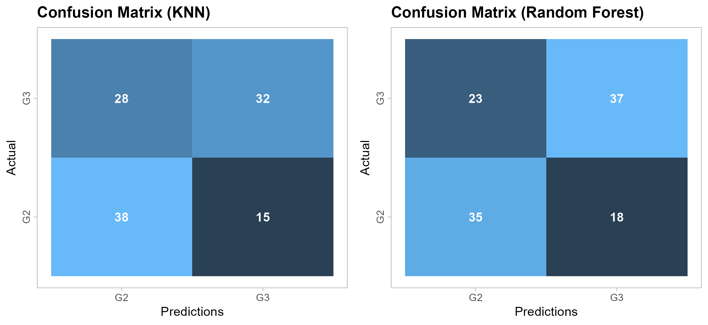
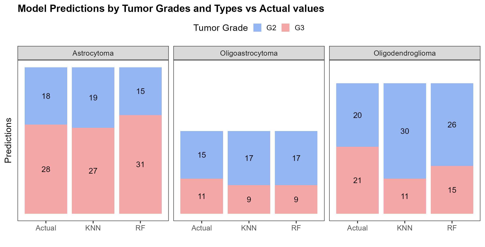

## 1. **Introduction to Gliomas, IDH Staus and their Significance**
Gliomas are the most common primary tumors found in the brain and spinal cord (Chen et al. 2017). They account for about 80% of all brain tumors(Li et al. 2022). Diffuse gliomas are a type of brain tumor that originates from the glial cells, which support and protect neurons(Neumaier, Zlatopolskiy, and Neumaier 2023; Yang et al. 2022). Adult diffuse gliomas are classified and graded based on histological features, including subtypes such as oligodendroglioma, oligoastrocytoma, astrocytoma, and glioblastoma, ranging from grade II to IV(Ceccarelli et al. 2016).
They are also usually classified based on the type of glial cells involved (e.g., astrocytes in astrocytomas) and their genetic mutations, particularly in the IDH gene(Louis et al. 2021). The IDH (Isocitrate Dehydrogenase) status is crucial for classifying diffuse gliomas, particularly astrocytomas and oligodendrogliomas. IDH mutations help distinguish glioma subtypes in the WHO classification, dividing tumors into IDH-mutant and IDH wild-type (Louis et al. 2021). Gliomas with IDH mutations generally have a better prognosis due to slower growth and improved survival. These mutations also produce an oncometabolite, altering cellular metabolism and driving tumorigenesis. Additionally, IDH mutations are potential therapeutic targets, with inhibitors being explored in clinical trials to offer new treatments (Louis et al. 2021).

## 2. **Methodology**
### 2.1 **Dataset Description and Preprocessing Steps**

Expression data for lower grade gliomas (LGG) cancer data for this study was sourced from [The Cancer Genome Atlas (TCGA)](https://www.cancer.gov/ccg/research/genome-sequencing/tcga). The dataset comprised 534 samples: 516 primary tumor cases and 18 recurrent cases. Only primary cases were selected.

### 2.2 **Data Preparation and Preprocessing**

Data preprocessing and normalization were conducted using the TCGAbiolinks library in R. The steps included

- **Filtering genes:** Genes with a correlation less than 0.6 across samples were removed.
- **Normalization:** Expression levels were normalized based on gene length and GC content.
- **Exclusion of low-expression genes:** Genes with expression levels below the 25th percentile were excluded.

### 2.3 **Biomarker Discovery and Machine Learning**

#### 2.3.1 **Differential Gene Expression (DGE) Analysis**

We performed DGE analysis using the likelihood ratio method, identifying differentially expressed genes based on the criteria: False discovery rate (FDR) < 0.05 and Absolute log fold change > 2. Genes with FDR < 0.05 and LogFC < -2 were classified as downregulated, while genes with FDR < 0.05 and LogFC > 2 were classified as upregulated. The preprocessed data, consisting of about 26,000 genes, was used for subsequent machine learning predictions (Fig 1). DGE analysis was based on the tumor grade (Grade 2 vs Grade 3) and IDH status (Wild type vs Mutant).

#### 2.3.2 **Pathway Enrichment Analysis**
We conducted pathway enrichment analysis to determine the biological roles of the upregulated and downregulated genes. This included analyzing the molecular functions, cellular localization, and biochemical pathways in which these genes are involved.

#### 2.3.3 **Machine Learning**

__Data Splitting__

The preprocessed dataset was split into train and test sets, with 75% for model development and the other 25% for model evaluation.

__Feature Selection__

- __Filtering:__ Statistically insignificant genes from DGE analysis (FDR > 0.05) were removed reducing the features to about 24,000 genes.
- __Lasso Logistic Regression:__ A Lasso regression model was used to select features by applying a penalty which shrank unimportant features to exactly zero. A total of 91 genes were selected for modelling based on non-zero coefficient values (Fig 6).

__Modeling__

The k-nearest neighbors (k-NN) and random forest models were used to train a model for predicting IDH status and tumor grades, respectively. The model's performance was evaluated using accuracy, recall, F1 score, precision, and specificity. To select optimal parameters, hyperparameter tuning with a 5-fold cross-validation was used and the set of parameters with the highest accuracy (IDH status) and F1 score (tumor grade) was selected. A confusion matrix representing each model's predictions on the test set and the actual class was visualized.

## 3. **Results**

### 3.1 **IDH Status**

___Table: Model Performance on test set___

Model        | Accuracy | Precision | Recall | F1 | Specificity
:------------|---------:|----------:|-------:|---:|-----------:
KNN          |99.2	    |100        |99.04   |99.52| 100
Random Forest|99.2	    |100        |99.04   |99.52| 100

__Figure 1:__ Confusion matrix on the test set (Tumour Grade)

### 3.2 **Tumor Grade**
___Table: Model Performance on test set___

Model        | Accuracy | Precision | Recall | F1  | Specificity
:------------|---------:|----------:|-------:|----:|-----------:
KNN          |63.3	    |69.2       |56.3    |62.1 | 71.4
Random Forest|66.6	    |62.8       |64.3    |63.5 | 66.7

__Figure 2:__ Confusion matrix on the test set (Tumour Grade)

From Table 2 and Figure 2, both models have problems distinguishing both tumor grades. We further examined the number of samples in each tumor type that were correctly detected by the models in the test data. The result can be found in Figure 3.

__Figure 3:__ Models Predictions of Tumor types and Grades vs Actual values
